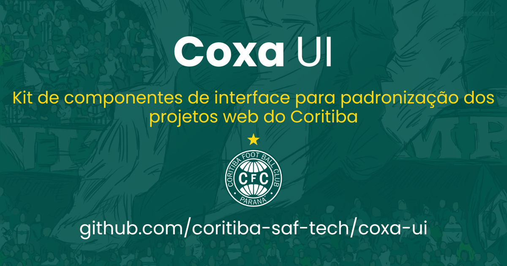

# CoxaUI

Kit de componentes de interface para padronização dos projetos web do **Coritiba Foot Ball Club (SAF)**. Sem dependências de build — importe via CDN e comece a usar.

## 📖 Documentação

**https://coritiba-saf-tech.github.io/coxa-ui/**

---

## Instalação via CDN

Adicione as duas linhas abaixo no `<head>` da sua página:

```html
<!-- CSS -->
<link rel="stylesheet" href="https://cdn.jsdelivr.net/npm/coxa-ui/coxa-ui.css">

<!-- JS (defer recomendado) -->
<script src="https://cdn.jsdelivr.net/npm/coxa-ui/coxa-ui.js" defer></script>
```

> O CoxaUI auto-injeta o **Tabler Icons v3**, o **SweetAlert2 v11** e o **Chart.js v4** — você não precisa importá-los separadamente.

---

## Estrutura básica de página

```html
<!DOCTYPE html>
<html lang="pt-BR">
<head>
  <meta charset="utf-8">
  <meta name="viewport" content="width=device-width,initial-scale=1">
  <title>Minha Aplicação</title>
  <link rel="stylesheet" href="https://cdn.jsdelivr.net/npm/coxa-ui/coxa-ui.css">
  <script src="https://cdn.jsdelivr.net/npm/coxa-ui/coxa-ui.js" defer></script>
</head>
<body>
<div class="app-layout">
  <aside class="sidebar" id="sidebar">
    <!-- Navegação lateral -->
  </aside>
  <div class="overlay" id="overlay" onclick="closeSidebar()"></div>
  <div class="content-col">
    <header>
      <button class="menu-btn" onclick="toggleSidebar()">
        <i class="ti ti-menu-2"></i>
      </button>
      <div class="hdr-page">Título da Página</div>
      <div class="hdr-right">
        <button class="btn btn-ghost btn-sm" onclick="toggleDark()">
          <i class="ti ti-moon" id="darkIcon"></i>
        </button>
      </div>
    </header>
    <main class="main">
      <!-- Conteúdo -->
    </main>
    <footer>
      <span>Minha App &copy; 2025</span>
    </footer>
  </div>
</div>
</body>
</html>
```

---

## O que você pode fazer com o CoxaUI

### Componentes visuais

| Componente | Descrição |
|---|---|
| **Botões** | `btn-primary`, `btn-secondary`, `btn-danger`, `btn-ghost`, `btn-sm`, `btn-lg` |
| **Badges** | `badge-success`, `badge-danger`, `badge-warning`, `badge-info`, `badge-neutral`, `badge-sm`, `badge-lg` |
| **Alertas** | `alert-success`, `alert-danger`, `alert-warning`, `alert-info` |
| **Cards** | `card-item` com `card-header` e `card-body` |
| **Stat Cards** | `stat-card` com `stat-label`, `stat-value`, `stat-trend` |
| **Tabelas** | `table` dentro de `tbl-wrap`, com `tbl-toolbar` e dropdown de ações |
| **Formulários** | `form-control`, `form-label`, `form-group`, `input-icon-wrap`, `chk-wrap`, validação `is-invalid`, input de horário (`type=time`), combobox com busca (`.combo`) |
| **Gráficos** | Chart.js v4 auto-injetado — `coxaChart(id, config)` com paleta da marca e tema claro/escuro |
| **Progresso** | `progress` + `progress-bar` com variantes `progress-success`, `progress-warning`, `progress-danger` |
| **Tabs** | `.tabs` + `.tab` + `.tab-panel` — controlado via `switchTab()` |
| **Acordeão** | `.accordion` + `.accordion-item` + `.accordion-btn` — controlado via `initAccordion()` |
| **Timeline** | `.timeline` + `.tl-item` com pontos coloridos `tl-dot-success`, `tl-dot-info`, `tl-dot-warning` |
| **Spinners** | `.spinner`, `.spinner-sm`, `.spinner-lg`, `.spinner-inline` |
| **Dropdowns** | `.act-dd` + `.act-dd-btn` + `.act-dd-menu` — controlado via `initDropdowns()` |
| **Modais** | `.modal-overlay` + `.modal-box` — controlado via `openModal()` / `closeModal()` |

### Layout

- **App layout** com sidebar colapsável, header fixo, área de conteúdo e footer
- **Modo escuro** automático via `html.dark` — persiste em `localStorage`
- **Responsivo** — sidebar vira drawer em telas pequenas

### Ícones

Tabler Icons v3 auto-importados — use `<i class="ti ti-nome"></i>`. Mais de 5.000 ícones disponíveis em [tabler.io/icons](https://tabler.io/icons).

### JavaScript API

| Função | Descrição |
|---|---|
| `toggleSidebar()` | Abre/fecha o sidebar |
| `closeSidebar()` | Fecha o sidebar |
| `toggleDark()` | Alterna modo escuro |
| `coxaToast(icon, msg)` | Toast notification via SweetAlert2 |
| `coxaConfirm(form, title, text, icon, confirmText, color)` | Diálogo de confirmação |
| `openModal(id)` | Abre modal pelo ID |
| `closeModal(id)` | Fecha modal pelo ID |
| `initModalOverlayClose(id)` | Fecha modal ao clicar fora |
| `initTableSearch(inputId, selector)` | Filtro de busca em tabela |
| `switchTab(btn, panelId)` | Troca aba ativa |
| `initAccordion()` | Inicializa acordeão |
| `initCombos()` | Combobox com busca (auto-inicializado) |
| `coxaChart(id, config)` | Cria gráfico Chart.js com paleta da marca |
| `initPageSpinner()` | Spinner de navegação global |
| `copyToClipboard(text, el?)` | Copia texto para clipboard |
| `mkSlug(text)` | Gera slug a partir de texto |
| `updateClock()` | Relógio ao vivo (`#live-clock`) |
| `updateElapsed()` | Tempo decorrido (`[data-entrada]`) |
| `toggleSelRow(chk)` | Seleção de linha em tabela |
| `toggleSelAll(chk)` | Selecionar/desmarcar tudo |
| `clearSel()` | Limpa seleção em massa |

---

## Cores da marca

```css
--primary:    #006B3C  /* Verde Coritiba */
--accent:     #fad716  /* Amarelo Coritiba */
--danger:     #ea580c  /* Laranja (nunca vermelho) */
--info:       #2563eb
--warning:    #d97706
```

---


## Repositório

[github.com/CORITIBA-SAF-TECH/coxa-ui](https://github.com/CORITIBA-SAF-TECH/coxa-ui)

---

## Changelog

### v0.1.0 — 09/07/2026

*Consolida as versões 0.0.4 a 0.1.0.*

#### Sidebar
- **Botão circular flutuante** na borda para recolher/expandir (estilo Notion/GitBook) — 32px, hover amarelo com chevron verde-escuro, acompanha a sidebar ao animar
- **Recolhida por padrão no desktop** — a escolha do usuário (aberta/fechada) fica salva em `localStorage` (`coxaui-sb`); aplicada antes do primeiro paint, sem piscar
- **Modo recolhido (60px)**: só ícones, com **tooltip automático** no hover (usa `data-label` ou o texto do `<span>` do link)
- Logo padrão: **100px** expandida, **50px** recolhida — abaixo do botão de recolher, com linha divisória
- Links da sidebar (`.sb-lnk`) **sem borda** em todos os estados
- Nome "Coritiba Foot Ball Club" removido da marca (`.sb-brand-club` oculto)

#### Novos componentes
- **Input de horário** — `input[type=time]` com o estilo padrão dos demais inputs; ícone do picker legível no modo escuro
- **Combobox** (`.combo`) — select com busca: digite e as opções são filtradas (ignora acentos); teclado ↑/↓, Enter, Esc; valor ≠ rótulo via `input.combo-value` + `data-value`; inicializado automaticamente (`initCombos()`)
- **Gráficos** — Chart.js v4 auto-injetado; `coxaChart(id, config)` aplica a paleta da marca e o tema claro/escuro automaticamente

#### Visual
- Modo claro: fundo da página mais escuro (`--bg: #dfe3e8`) para destacar os cards brancos
- Dark mode: `chk-opt`, `tipo-opt` e `input[type=range]` corrigidos (texto `#6ee7b7`, `accent-color #34d399`)

#### Documentação
- Demos da sidebar (expandida e recolhida) refeitos com o novo botão e tooltip funcionais
- Novos exemplos: Horário (HH:MM), Select com busca (Combobox) e Gráficos
- Stat Cards agora fica junto da seção de Cards

---

### v0.0.3 — 01/07/2026

#### Dark mode
- Correções abrangentes de contraste em modo escuro: 21 seletores corrigidos (`color: var(--primary)` → `#6ee7b7` sobre fundos escuros)
- Componentes corrigidos: pills/cards de tipo selecionados, loc-card selecionado, card-item hover, link-card ícone, links-tab hover, avatar, field-tag, hist-badge, step-item, modal-title, tabs, post-content (headings, links, tabela, blockquote), bpmn-canvas, btn-ghost hover, form-card h2, adm-hdr h2, pg-hdr h1, text-primary, ci-sec, pv-sec

#### Documentação (index.html)
- Botões do TOC sidebar seguem o padrão `.sb-lnk`: flex, borda, hover amarelo, active fundo amarelo
- Active do TOC atualizado conforme rolagem (listener no `.docs-main`, não no `window`)
- Botão npm no topbar (ao lado de GitHub e dark mode)

#### package.json
- Adicionados campos `files`, `keywords`, `author`, `jsdelivr`, `unpkg`; removido `type: "commonjs"`

---

### v0.0.2 — 01/07/2026

#### Novidades
- **Documentação interativa** (`index.html`) com sidebar de navegação, modo escuro e botões "Ver código / Copiar" em cada componente
- **Seção de instalação via CDN** com estrutura básica de página e alerta de versão beta
- **Footer fixo** sempre visível — layout `docs-right` com header, conteúdo rolável e footer em coluna
- **Favicon** e **logo** no cabeçalho da documentação
- **Botão GitHub** no topbar da docs

#### Componentes
- `COXAUI_VERSION` exportada no JS — log estilizado no console do navegador na carga
- `[data-coxaui-ver]` — elementos HTML recebem a versão dinamicamente via JS
- **Barra de progresso striped** agora é animada por padrão
- **Seletor de Localidade** (`.loc-card`) corrigido: ícone, nome e quantidade em linhas separadas
- **Cards de Tipo** (`.tipo-card`) — cor padrão unificada (verde primário)

#### Visual
- Animações fluidas adicionadas: hover lift em botões e cards, entrada suave em modais, dropdowns e alertas
- Cores de status escurecidas para maior contraste (nível 200 da paleta)
- Swatches de cor na docs com nome / variável CSS / hex em linhas separadas
- Cor "Danger" alterada de vermelho para âmbar (`--amber-bg`) — vermelho é proibido no projeto
- `code` global estilizado com suporte a modo escuro (`html.dark code`)

#### Correções
- `<td><code>` legível no modo escuro
- Ícones na sidebar da documentação

---

### v0.0.1 — 30/06/2026

- Versão inicial do CoxaUI
- CSS com variáveis de marca, componentes base e modo escuro
- JS com sidebar, dark mode, SweetAlert2, tabelas, modais, tabs, acordeão e seleção em lote